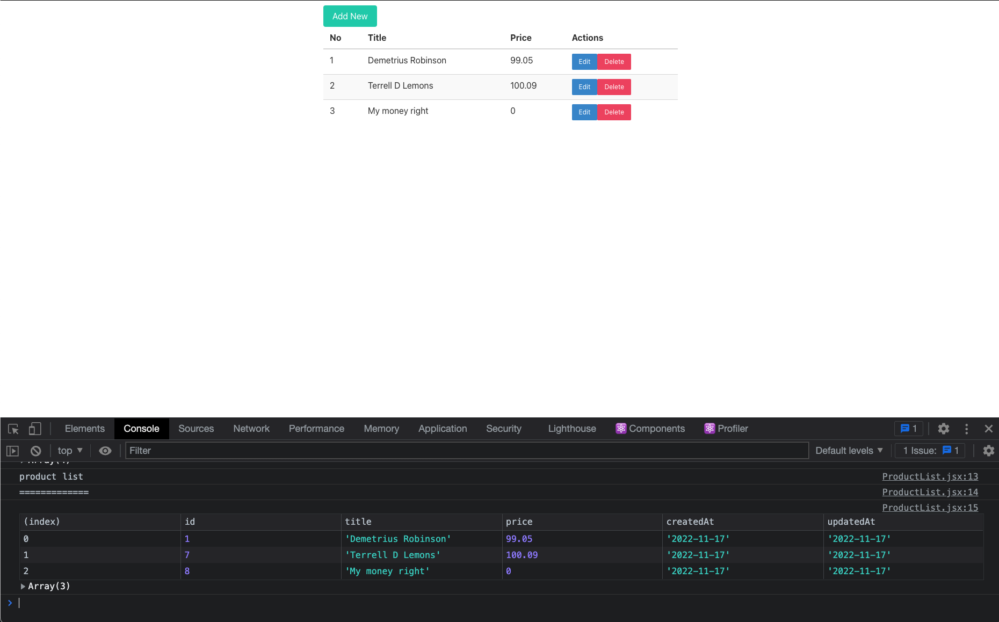

# FULLSTACK-MYSQL-APP

<h1 style="color:yellow; font-family: Zapfino"> Da' Lemon Line </h1>

Where Luxury is Close By!

---

## START BACKEND

```bash
cd backend
npm run server
```

---

## START FRONTEND

```bash
cd frontend
npm start
```

---

## Languages

- MySQL
- React
- React-Bootstrap
- HTML
- CSS
- JavaScript
- Shell

---

## GitHub

[Project on Github](https://github.com/LemonmadeDesigns/FULLSTACK-MYSQL-APP)

---

## Working App


[Working App](./frontend/src/imgs/working-app.png)

---

## Working on MySQL Workbench


[Working on MySQL Workbench](./frontend/src/imgs/working-app.png)
